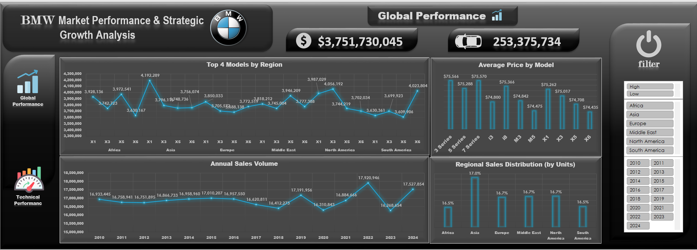
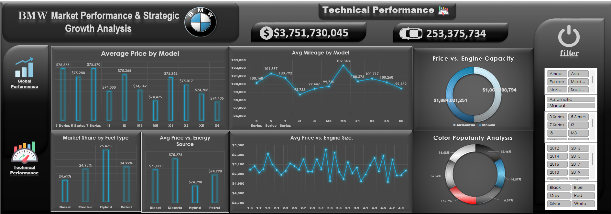
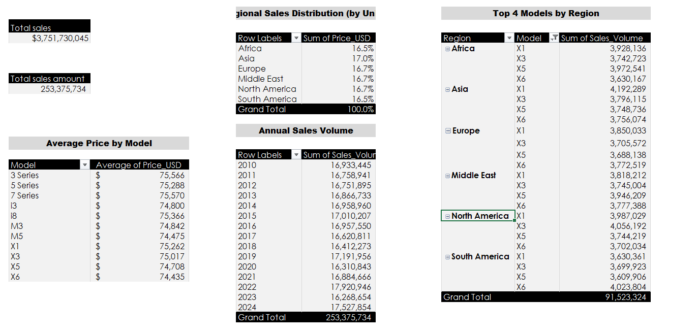
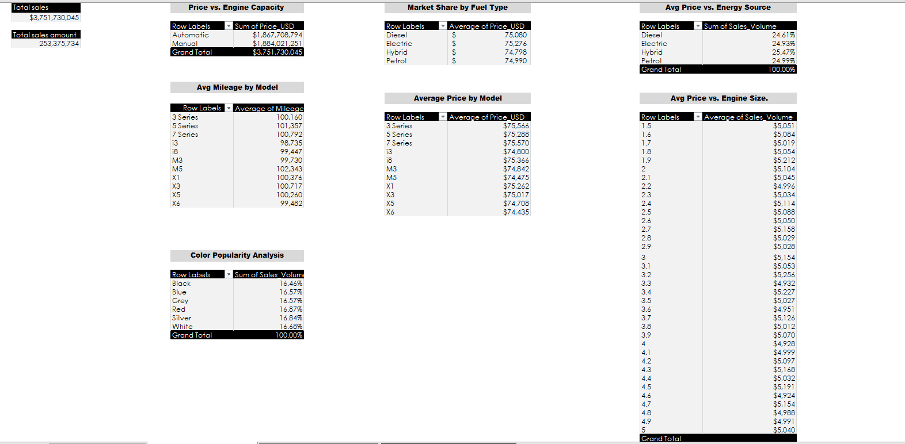

# 🚗 BMW Global Sales Intelligence Dashboard
### *Transforming 5,000 Rows of Global Automotive Data into Executive-Ready Strategic Intelligence — Built Entirely in Microsoft Excel*

> **$3.75 Billion in Revenue · 253 Million Units · 5,000 Records · 6 Regions · 11 Models · 15 Years (2010–2024)**

---

## 🖼️ Interactive Dashboard Showcase

### 📊 Page 1 — Global Performance Dashboard

> *Interactive Excel layout focusing on annual sales volume, geographical distribution, and top models by region.*

### ⚙️ Page 2 — Technical Performance Dashboard

> *Interactive Excel layout tracking fuel type market share, transmission splits, color popularity, and mileage configurations.*

### 🗃️ Under the Hood: Data Aggregation & Pivot Tables
To capture the business logic behind these dashboards, custom multi-level Pivot Tables were constructed to clean, slice, and summarize the core dataset.

| Global Performance Behind-the-Scenes | Technical Performance Behind-the-Scenes |
|---|---|
|  |  |

---

## 📊 Project Overview & Business Problem

### 🎯 The Business Challenge
BMW's global sales leadership needed a **single, unified analytical view** to answer critical strategic questions across **6 regions, 11 vehicle models, 4 fuel types, and 15 years of market activity (2010–2024)** — all contained within a structured dataset of **5,000 sales records**.

Without a consolidated reporting layer, these questions went unanswered:
- Which models and regions are the true revenue drivers?
- How is buyer demand shifting across fuel types — Diesel, Electric, Hybrid, and Petrol?
- Is BMW's pricing consistent across global markets and powertrain configurations?
- Which color preferences and engine profiles dominate purchasing decisions?

### 💡 The Solution
A **two-page interactive Excel dashboard** built directly on a 5,000-row dataset, using **Pivot Tables as the core analytical engine** and **Dynamic Slicers** for real-time filtering — enabling stakeholders to explore the full data story without any SQL, Python, or external BI tool.

---

## 📐 Key Project Metrics

| Metric | Value |
|---|---|
| 📁 Dataset Size | **5,000 rows** of structured global sales data |
| 📅 Time Period | **2010 – 2024** (15 Years) |
| 🌍 Regions Covered | **6** (Africa, Asia, Europe, Middle East, North America, South America) |
| 🚘 Models Analyzed | **11** (3 Series, 5 Series, 7 Series, i3, i8, M3, M5, X1, X3, X5, X6) |
| ⛽ Fuel Types | **4** (Diesel, Electric, Hybrid, Petrol) |
| 💰 Total Revenue Tracked | **$3,751,730,045** |
| 📦 Total Units Tracked | **253,375,734** |
| 📊 Dashboard Pages | **2** (Global Performance + Technical Performance) |

---

## 🛠️ Tech Stack & Core Excel Skills

| Category | Skills Applied |
|---|---|
| **Core Analytical Engine** | Pivot Tables — multi-level aggregation, grouping, custom value fields, cross-tabulation across 5,000 rows |
| **Dynamic Interactivity** | Slicers connected across multiple Pivot Tables — filtering by Region, Year, Model, Fuel Type, Color, and Transmission |
| **Data Visualization** | Line charts, bar/column charts, donut charts — all dynamically linked to Pivot Table outputs |
| **KPI Design** | Custom KPI cards displaying Total Revenue ($3.75B) and Total Units (253M) with branded iconography |
| **Dashboard Layout & UX** | Two-page dark-theme layout, structured panel design, branded BMW color palette, clean visual hierarchy |
| **Business Data Analysis** | Pattern recognition, trend identification, market share analysis, and strategic insight extraction from structured data |
| **Conditional Formatting** | Data bars and color scales applied to highlight performance variance across models and regions |

---

## 📈 Key Business Insights & Recommendations

### 🌍 Global Performance (Page 1)
- **📦 SUV Dominance Across All Regions:** The **X5 and X6** consistently lead sales volume across all 6 regions, confirming that BMW's SUV lineup is the core commercial engine — warranting continued platform investment and localized variant development.
- **📉 COVID-19 Demand Shock & Recovery:** Annual global sales declined sharply to **14.31M units in 2020** before rebounding to a peak of **17.92M units in 2021** — a recovery of over **25%** in a single year. This pattern underscores the importance of agile inventory and supply chain planning for future disruption scenarios.
- **💵 Consistent Pricing Discipline:** Average selling prices across all 11 models fall within a narrow band of **$74,435 – $75,570**, indicating that BMW maintains strong pricing integrity across global markets — with the **3 Series and 5 Series** commanding the highest ASPs among non-M models.
- **🌐 Well-Diversified Regional Portfolio:** Sales distribution across the 6 regions is nearly uniform, ranging from **16.5% to 17.0%** — with Asia leading at 17.0%. This balance significantly reduces single-market revenue dependency and reflects a resilient global commercial strategy.

---

### ⚙️ Technical Performance (Page 2)
- **🔋 Critical Electrification Inflection Point:** Hybrid fuel type leads market share at **25.47%**, with Electric at **24.93%**, Petrol at **24.99%**, and Diesel at **24.61%**. The near-equal four-way split signals that the market is at a pivotal transition moment — BMW should accelerate EV infrastructure partnerships to convert Hybrid buyers into full EV adopters.
- **⚡ Diesel's Counterintuitive Price Premium:** Despite declining demand narratives, Diesel holds the **highest average selling price** (~$75,276) across all fuel types — suggesting Diesel buyers are selecting larger, higher-specification models. This warrants deeper SKU-level analysis before phasing out Diesel variants.
- **📏 Performance Model Loyalty Signal:** The **M3 records the highest average mileage at 102,343 miles**, indicating strong long-term ownership retention among performance car buyers — a key loyalty indicator that supports the business case for continued M-series development and dedicated aftersales programs.
- **🔧 Balanced Transmission Split:** Automatic transmission generates **~$1.88B** in revenue versus Manual's **~$1.86B** — an almost equal split confirming that BMW's dual-transmission strategy remains commercially justified, though the shift toward automatic (particularly in EV models) will likely dominate by 2027.
- **🎨 Neutral Color Dominance — Inventory Planning Signal:** Black (**16.87%**) and Grey (**16.84%**) are the top buyer color choices, consistent with global luxury automotive trends. **Production weighting should favor neutral tones** to minimize days-on-lot and reduce discounting pressure on slow-moving colors.
- **🔩 Technology Over Displacement:** The Avg Price vs. Engine Size analysis reveals **no strong linear premium for larger engines** — buyers are paying for brand reputation, technology, and features rather than raw displacement. This validates BMW's strategic shift toward turbocharged smaller engines and electrified powertrains.

---

## 🔐 Confidentiality & Data Access Notice

> ⚠️ **Note:** The underlying Pivot Table architecture and interactive engine are demonstrated fully through this visual showcase. The raw data source used for this analysis is a publicly accessible automotive dataset.

**🤝 Available for a Live Demo?**
A full interactive walkthrough — including real-time slicer filtering and drill-down across all 5,000 records — is available **upon request during interviews or portfolio reviews.**

📩 Connect via [LinkedIn](https://www.linkedin.com/in/mahmoud-hamdi-analyst) · [Email](mailto:mahmoudhamdiwm@gmail.com)

## 📁 Repository Structure

```text
📦 BMW-Global-Sales-Intelligence/
├── 📂 dataset/
│   └── BMW sales data (2010–2024).csv       # Raw 5,000-row global sales dataset
├── 📂 screenshots/
│   ├── 01_global_performance_dashboard.png # Main page dashboard interface
│   ├── 02_technical_performance_dashboard.png # Technical breakdown interface
│   ├── 03_global_pivot_tables.png          # Core backend analytics data
│   └── 04_technical_pivot_tables.png       # Engineering and secondary metadata
└── 📄 README.md                            # Comprehensive project documentation
